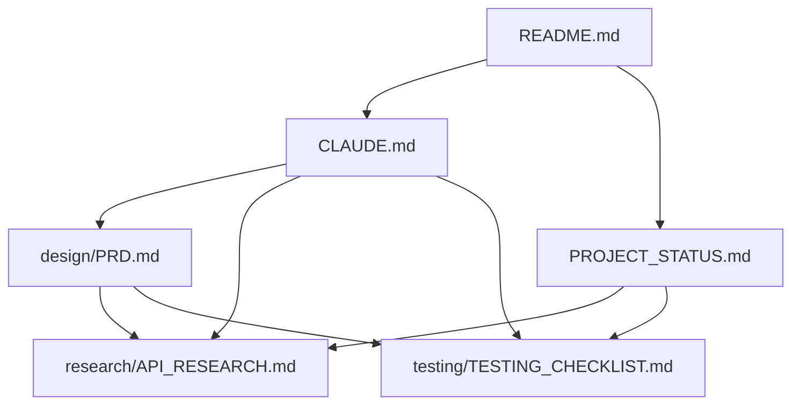

# Documentation Index

Complete documentation for the VS Code Extension Security Scanner project.

## Quick Navigation

| Document | Purpose | Audience |
|----------|---------|----------|
| [../README.md](../README.md) | Project overview and quick start | All users |
| [../CLAUDE.md](../CLAUDE.md) | Development guidance and specifications | Claude Code / Developers |
| [PROJECT_STATUS.md](PROJECT_STATUS.md) | Current status and roadmap | All users |

## Documentation Structure

```
docs/
├── README.md              # This file - documentation index
├── PROJECT_STATUS.md      # Current project status and progress
├── design/
│   └── PRD.md            # Product Requirements Document
├── research/
│   └── API_RESEARCH.md   # vscan.dev API research findings
└── testing/
    └── TESTING_CHECKLIST.md  # Comprehensive test plan
```

## By Category

### 📋 Planning & Requirements

- **[design/PRD.md](design/PRD.md)** - Complete product requirements
  - Scope and objectives
  - User stories
  - Technical specifications
  - Success criteria
  - Out of scope features

- **[PROJECT_STATUS.md](PROJECT_STATUS.md)** - Project tracking
  - Phase completion status
  - Test results
  - Timeline and estimates
  - Risk assessment
  - Next actions

### 🔬 Research & Technical

- **[research/API_RESEARCH.md](research/API_RESEARCH.md)** - vscan.dev API documentation
  - API endpoints (analyze, status, results)
  - Request/response formats
  - Test results from 3 extensions
  - Implementation recommendations
  - Edge cases and unknowns

### 🧪 Testing & Quality

- **[testing/TESTING_CHECKLIST.md](testing/TESTING_CHECKLIST.md)** - Test plan
  - API behavior tests
  - Extension discovery tests
  - Cross-platform tests
  - Error handling tests
  - Performance tests
  - Security tests

## By Development Phase

### Phase 1: Research & Discovery ✅ COMPLETE

**Primary Documents:**
- [research/API_RESEARCH.md](research/API_RESEARCH.md) - API validation results
- [PROJECT_STATUS.md](PROJECT_STATUS.md) - Phase 1 summary

**What Was Achieved:**
- Reverse-engineered vscan.dev API
- Validated 3 endpoints with real extensions
- 100% test success rate
- Documented all findings

### Phase 2: Core Implementation ⏳ NOT STARTED

**Primary Documents:**
- [../CLAUDE.md](../CLAUDE.md) - Implementation guidance
- [design/PRD.md](design/PRD.md) - Requirements reference

**Implementation Guide:**
- Module structure recommendations
- API integration examples from test_api.py
- JSON output schema
- Error handling strategy

### Phase 3: Testing & Refinement ⏳ NOT STARTED

**Primary Documents:**
- [testing/TESTING_CHECKLIST.md](testing/TESTING_CHECKLIST.md) - Complete test plan
- [PROJECT_STATUS.md](PROJECT_STATUS.md) - Success criteria

**Testing Focus:**
- Cross-platform compatibility
- Edge cases and error scenarios
- Performance benchmarks
- User experience

## By Role

### For Developers

**Start Here:**

1. [../README.md](../README.md) - Project overview
2. [../CLAUDE.md](../CLAUDE.md) - Development guidance
3. [research/API_RESEARCH.md](research/API_RESEARCH.md) - API details
4. [design/PRD.md](design/PRD.md) - Requirements

### For Project Managers

**Start Here:**

1. [PROJECT_STATUS.md](PROJECT_STATUS.md) - Current progress
2. [design/PRD.md](design/PRD.md) - Requirements and scope
3. [../README.md](../README.md) - Project summary

### For Testers

**Start Here:**

1. [testing/TESTING_CHECKLIST.md](testing/TESTING_CHECKLIST.md) - Test plan
2. [research/API_RESEARCH.md](research/API_RESEARCH.md) - Expected behavior
3. [design/PRD.md](design/PRD.md) - Requirements to verify

## Document Relationships



## Statistics

| Metric | Value |
|--------|-------|
| **Total Documentation** | ~1,700 lines |
| **Number of Documents** | 7 files |
| **API Endpoints Documented** | 3 |
| **Test Cases Defined** | 100+ |
| **Phases Documented** | 3 |

## Recent Updates

- **2025-10-22** - Reorganized documentation structure
  - Created logical folder hierarchy
  - Eliminated redundancies (PHASE1_SUMMARY.md, STATUS.md merged)
  - Updated CLAUDE.md to reference other docs
  - Reduced documentation from 1,986 to ~1,700 lines

- **2025-10-22** - Phase 1 completion
  - Added API_RESEARCH.md with test results
  - Created PROJECT_STATUS.md tracking
  - Validated all vscan.dev API endpoints

## Contributing to Documentation

When updating documentation:

1. **Keep CLAUDE.md concise** - It should reference details, not duplicate them
2. **Update PROJECT_STATUS.md** - Reflect current progress
3. **Use proper folder structure** - Design, research, or testing
4. **Cross-reference documents** - Link related content
5. **Update this index** - Keep it current

## Questions?

- **Implementation questions?** See [../CLAUDE.md](../CLAUDE.md)
- **Requirements questions?** See [design/PRD.md](design/PRD.md)
- **API questions?** See [research/API_RESEARCH.md](research/API_RESEARCH.md)
- **Testing questions?** See [testing/TESTING_CHECKLIST.md](testing/TESTING_CHECKLIST.md)
