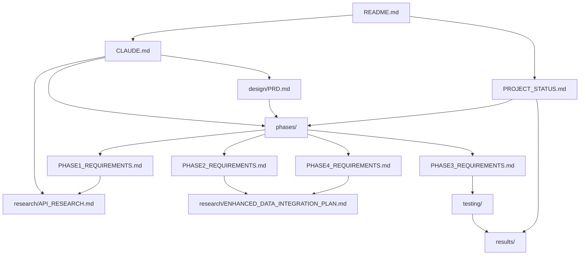

# Documentation Index

Complete documentation for the VS Code Extension Security Scanner project.

## Quick Navigation

| Document | Purpose | Audience |
|----------|---------|----------|
| [../README.md](../README.md) | Project overview and quick start | All users |
| [../CLAUDE.md](../CLAUDE.md) | Development guidance and specifications | Claude Code / Developers |
| [PROJECT_STATUS.md](PROJECT_STATUS.md) | Current status and roadmap | All users |

## Documentation Structure

```
docs/
├── README.md                  # This file - documentation index
├── PROJECT_STATUS.md          # Current project status and progress
├── phases/                    # Phase-specific requirements
│   ├── PHASE1_REQUIREMENTS.md # Research & Discovery
│   ├── PHASE2_REQUIREMENTS.md # Core Implementation
│   ├── PHASE3_REQUIREMENTS.md # Testing & Refinement
│   └── PHASE4_REQUIREMENTS.md # Enhanced Data Integration
├── design/                    # Design documents
│   └── PRD.md                # Product Requirements Document
├── research/                  # Research findings
│   ├── API_RESEARCH.md       # vscan.dev API research
│   └── ENHANCED_DATA_INTEGRATION_PLAN.md
├── testing/                   # Test plans and results
│   ├── TESTING_CHECKLIST.md  # Test checklist
│   ├── MACOS_TESTING.md      # macOS test plan
│   └── MACOS_TEST_RESULTS.md # macOS test results
├── results/                   # Phase completion summaries
│   ├── PHASE3_COMPLETION_SUMMARY.md
│   └── PHASE4_COMPLETION_SUMMARY.md
└── security/                  # Security analysis
    ├── SECURITY_ANALYSIS.md
    ├── SECURITY_FIXES_APPLIED.md
    └── SECURITY_QUICK_FIX_GUIDE.md
```

## By Category

### 📋 Planning & Requirements

- **[design/PRD.md](design/PRD.md)** - Complete product requirements
  - Scope and objectives
  - User stories
  - Technical specifications
  - Success criteria
  - Phase milestones with references

- **[PROJECT_STATUS.md](PROJECT_STATUS.md)** - Project tracking
  - Phase completion status
  - Test results
  - Timeline and estimates
  - Risk assessment
  - Next actions

### 🎯 Phase Requirements

- **[phases/PHASE1_REQUIREMENTS.md](phases/PHASE1_REQUIREMENTS.md)** - Research & Discovery
  - API endpoint discovery
  - Request/response documentation
  - Proof of concept development
  - Validation testing

- **[phases/PHASE2_REQUIREMENTS.md](phases/PHASE2_REQUIREMENTS.md)** - Core Implementation
  - Extension discovery module
  - vscan.dev API integration
  - Output formatting
  - Caching system
  - CLI interface

- **[phases/PHASE3_REQUIREMENTS.md](phases/PHASE3_REQUIREMENTS.md)** - Testing & Refinement
  - Caching system testing
  - Platform testing (macOS)
  - Extension set testing
  - Error scenario testing
  - Performance validation

- **[phases/PHASE4_REQUIREMENTS.md](phases/PHASE4_REQUIREMENTS.md)** - Enhanced Data Integration
  - Complete data capture
  - Dual output modes
  - Publisher verification
  - Dependency analysis
  - Security score breakdown

### 🔬 Research & Technical

- **[research/API_RESEARCH.md](research/API_RESEARCH.md)** - vscan.dev API documentation
  - API endpoints (analyze, status, results)
  - Request/response formats
  - Test results from 3 extensions
  - Implementation recommendations
  - Edge cases and unknowns

- **[research/ENHANCED_DATA_INTEGRATION_PLAN.md](research/ENHANCED_DATA_INTEGRATION_PLAN.md)** - Phase 4 implementation plan
  - Data field mapping
  - Schema design
  - Migration strategy

### 🧪 Testing & Quality

- **[testing/TESTING_CHECKLIST.md](testing/TESTING_CHECKLIST.md)** - Test plan
  - API behavior tests
  - Extension discovery tests
  - Caching system tests
  - Error handling tests
  - Performance tests
  - Security tests

- **[testing/MACOS_TESTING.md](testing/MACOS_TESTING.md)** - macOS test plan
  - Test environment setup
  - Test scenarios
  - Expected results

- **[results/MACOS_TEST_RESULTS.md](results/MACOS_TEST_RESULTS.md)** - macOS test results
  - Actual test outcomes
  - Performance benchmarks
  - Issues found and resolved

### 📊 Results

- **[results/PHASE3_COMPLETION_SUMMARY.md](results/PHASE3_COMPLETION_SUMMARY.md)** - Phase 3 summary
  - Testing achievements
  - Performance metrics
  - Bug fixes

- **[results/PHASE4_COMPLETION_SUMMARY.md](results/PHASE4_COMPLETION_SUMMARY.md)** - Phase 4 summary
  - New features
  - Enhanced data integration
  - Sample outputs

### 🔒 Security

- **[security/SECURITY_ANALYSIS.md](security/SECURITY_ANALYSIS.md)** - Security vulnerability analysis
  - Identified vulnerabilities
  - Severity ratings
  - Risk assessments

- **[results/SECURITY_FIXES_APPLIED.md](results/SECURITY_FIXES_APPLIED.md)** - Applied security fixes
  - Remediation details
  - Code changes

- **[security/SECURITY_QUICK_FIX_GUIDE.md](security/SECURITY_QUICK_FIX_GUIDE.md)** - Quick fix guide
  - Step-by-step fixes
  - Validation steps

## By Development Phase

### Phase 1: Research & Discovery ✅ COMPLETE

**Requirements:** [phases/PHASE1_REQUIREMENTS.md](phases/PHASE1_REQUIREMENTS.md)

**Primary Documents:**
- [research/API_RESEARCH.md](research/API_RESEARCH.md) - API validation results
- [PROJECT_STATUS.md](PROJECT_STATUS.md) - Phase 1 summary

**What Was Achieved:**
- Reverse-engineered vscan.dev API
- Validated 3 endpoints with real extensions
- 100% test success rate
- Documented all findings

### Phase 2: Core Implementation ✅ COMPLETE

**Requirements:** [phases/PHASE2_REQUIREMENTS.md](phases/PHASE2_REQUIREMENTS.md)

**Primary Documents:**
- [../CLAUDE.md](../CLAUDE.md) - Implementation guidance
- [design/PRD.md](design/PRD.md) - Requirements reference

**What Was Achieved:**

- All 6 core modules implemented (1,590 LOC)
- Extension discovery for all platforms
- Complete API integration
- SQLite caching system
- 12+ CLI arguments

### Phase 3: Testing & Refinement ✅ COMPLETE

**Requirements:** [phases/PHASE3_REQUIREMENTS.md](phases/PHASE3_REQUIREMENTS.md)

**Primary Documents:**
- [testing/TESTING_CHECKLIST.md](testing/TESTING_CHECKLIST.md) - Complete test plan
- [results/MACOS_TEST_RESULTS.md](results/MACOS_TEST_RESULTS.md) - Test results
- [results/PHASE3_COMPLETION_SUMMARY.md](results/PHASE3_COMPLETION_SUMMARY.md) - Summary

**What Was Achieved:**

- Comprehensive caching system testing
- macOS testing (100% pass rate)
- Tested with 3, 66, and 100+ extensions
- Performance validation (28x cache speedup)
- UX refinements

### Phase 4: Enhanced Data Integration ✅ COMPLETE

**Requirements:** [phases/PHASE4_REQUIREMENTS.md](phases/PHASE4_REQUIREMENTS.md)

**Primary Documents:**
- [research/ENHANCED_DATA_INTEGRATION_PLAN.md](research/ENHANCED_DATA_INTEGRATION_PLAN.md) - Implementation plan
- [results/PHASE4_COMPLETION_SUMMARY.md](results/PHASE4_COMPLETION_SUMMARY.md) - Summary

**What Was Achieved:**
- Complete vscan.dev data capture
- Dual output modes (standard/detailed)
- Publisher verification
- Dependency analysis
- Security score breakdown
- Cache schema v2.0
- Version 2.0 release

## By Role

### For Developers

**Start Here:**

1. [../README.md](../README.md) - Project overview
2. [../CLAUDE.md](../CLAUDE.md) - Development guidance
3. [phases/](phases/) - Phase-specific requirements
4. [research/API_RESEARCH.md](research/API_RESEARCH.md) - API details
5. [design/PRD.md](design/PRD.md) - Requirements

### For Project Managers

**Start Here:**

1. [PROJECT_STATUS.md](PROJECT_STATUS.md) - Current progress
2. [design/PRD.md](design/PRD.md) - Requirements and scope
3. [results/](results/) - Phase completion summaries
4. [../README.md](../README.md) - Project summary

### For Testers

**Start Here:**

1. [testing/TESTING_CHECKLIST.md](testing/TESTING_CHECKLIST.md) - Test plan
2. [results/MACOS_TEST_RESULTS.md](results/MACOS_TEST_RESULTS.md) - Test results
3. [research/API_RESEARCH.md](research/API_RESEARCH.md) - Expected behavior
4. [design/PRD.md](design/PRD.md) - Requirements to verify

### For Security Analysts

**Start Here:**

1. [security/SECURITY_ANALYSIS.md](security/SECURITY_ANALYSIS.md) - Vulnerability analysis
2. [results/SECURITY_FIXES_APPLIED.md](results/SECURITY_FIXES_APPLIED.md) - Applied fixes
3. [results/SECURITY_QUICK_FIX_GUIDE.md](results/SECURITY_QUICK_FIX_GUIDE.md) - Fix guide

## Document Relationships



## Statistics

| Metric | Value |
|--------|-------|
| **Total Documentation** | ~5,000+ lines |
| **Number of Documents** | 17 files |
| **API Endpoints Documented** | 3 |
| **Test Cases Defined** | 100+ |
| **Phases Documented** | 4 (all complete) |
| **Modules Implemented** | 6 |

## Recent Updates

- **2025-10-23** - Reorganized documentation structure v2.0
  - Created phase-specific requirement files (PHASE1-4)
  - Moved security documentation to docs/security/
  - Created docs/results/ for completion summaries
  - Updated all cross-references in PRD and CLAUDE.md
  - Improved navigation and discoverability

- **2025-10-22** - Phase 4 completion (v2.0 release)
  - Enhanced data integration complete
  - Dual output modes implemented
  - Cache schema upgraded to v2.0

- **2025-10-22** - Phase 3 completion
  - macOS testing complete (100% pass rate)
  - Performance validated (28x cache speedup)
  - UX refinements applied

- **2025-10-22** - Initial documentation structure
  - Created logical folder hierarchy
  - Established documentation standards

## Contributing to Documentation

When updating documentation:

1. **Use proper folder structure:**
   - `phases/` - Phase requirements
   - `design/` - Design documents
   - `research/` - Research findings
   - `testing/` - Test plans and results
   - `results/` - Phase summaries
   - `security/` - Security analysis

2. **Keep phase requirements separate** - Each phase has its own detailed file

3. **Update cross-references** - When moving files, update links in:
   - CLAUDE.md
   - PRD.md
   - This index (README.md)

4. **Keep summaries in results/** - Phase completion summaries go in results/

5. **Link related content** - Use relative paths for cross-references

6. **Update this index** - Keep navigation current

## Questions?

- **Implementation questions?** See [../CLAUDE.md](../CLAUDE.md)
- **Requirements questions?** See [design/PRD.md](design/PRD.md)
- **Phase-specific questions?** See [phases/](phases/)
- **API questions?** See [research/API_RESEARCH.md](research/API_RESEARCH.md)
- **Testing questions?** See [testing/TESTING_CHECKLIST.md](testing/TESTING_CHECKLIST.md)
- **Security questions?** See [security/](security/)
