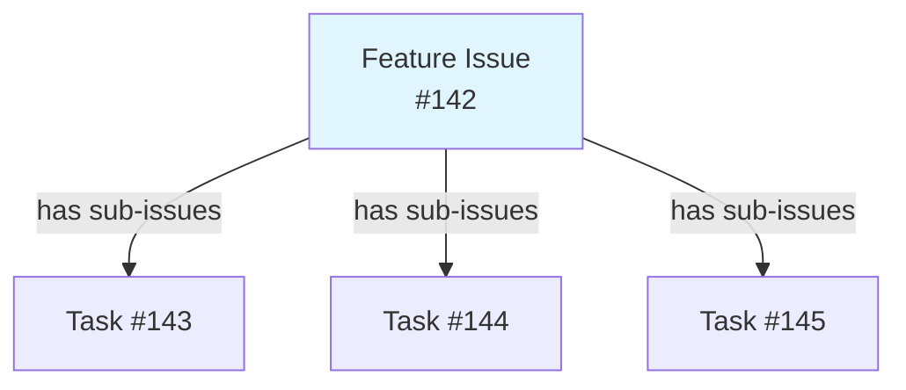
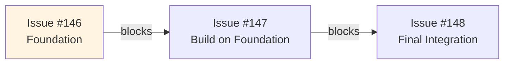
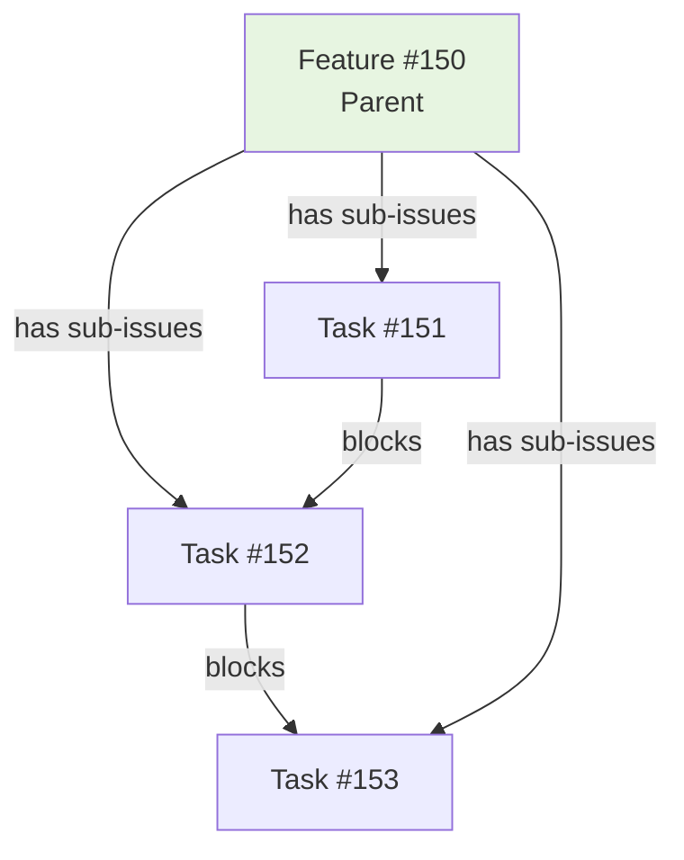

# GitHub Issue Relationships Guide

**Purpose**: Comprehensive reference for parent-child hierarchies and blocking dependencies

**Audience**: Developers managing complex features, release planning, technical dependencies

---

## Overview

GitHub provides two relationship systems for organizing and tracking work:

| Relationship Type | API | Purpose | Visual Indicator |
|-------------------|-----|---------|------------------|
| **Parent-Child** | GraphQL | Hierarchical breakdown (Epic → Story → Task) | Sub-issues list on parent |
| **Blocking** | REST | Technical dependencies (A must complete before B) | "Blocked" badge |

**Key Principle**: Parent-child shows *structure*, blocking shows *sequence*.

---

## Relationship Management Diagrams

### 1. Parent-Child (Hierarchy)



### 2. Blocking Dependencies (Sequential)



### 3. Combined (Real-World)



---

## Parent-Child Relationships

### When to Use

**Use Case**: Feature breakdown, epic → story structure, hierarchical task organization

**Characteristics**:
- **Visual hierarchy**: Parent shows child progress summary
- **One parent per child**: Each child has exactly one parent
- **GraphQL API**: Must use `addSubIssue` mutation
- **Limit**: 100 sub-issues per parent maximum

### Example Scenarios

```
[FEATURE] Add CSV Export (#142)
  ├─ [TASK] Implement CSV formatter class (#143)
  ├─ [TASK] Add export command to CLI (#144)
  └─ [TASK] Add CSV export tests (#145)
```

**When to use**:
- Feature split into multiple implementation tasks
- Epic requires multiple sub-features
- Release tracking with multiple component issues
- Large refactoring split into smaller PRs

### How to Create

**Automated Script** (RECOMMENDED):

```bash
# Create all issues first
gh issue create --title "[FEATURE] Add CSV Export" --body "..." --label "feature"
gh issue create --title "[TASK] Implement CSV formatter" --body "..." --label "task"
gh issue create --title "[TASK] Add export command" --body "..." --label "task"
gh issue create --title "[TASK] Add CSV tests" --body "..." --label "task"

# Set parent-child relationships (one command for all children)
./scripts/github-projects/manage-issue-relationships.sh set-parent 142 143 144 145

# Verify relationship created
./scripts/github-projects/manage-issue-relationships.sh view 142
```

**Manual GraphQL** (for learning):

```bash
# 1. Get node IDs
PARENT_NODE_ID=$(gh api repos/:owner/:repo/issues/142 --jq '.node_id')
CHILD_NODE_ID=$(gh api repos/:owner/:repo/issues/143 --jq '.node_id')

# 2. Create relationship via GraphQL mutation
gh api graphql -f query='mutation {
  addSubIssue(input: {
    issueId: "'"$PARENT_NODE_ID"'"
    subIssueId: "'"$CHILD_NODE_ID"'"
  }) {
    issue {
      number
      title
    }
  }
}'

# 3. Verify
gh api repos/:owner/:repo/issues/142 --jq '.sub_issues_summary.total'
```

### Verification

```bash
# Check parent has sub-issues
gh api repos/:owner/:repo/issues/142 --jq '.sub_issues_summary.total'
# Output: 3

# Check child has parent
gh api repos/:owner/:repo/issues/143 --jq '.parent_issue_url'
# Output: https://api.github.com/repos/owner/repo/issues/142

# View all relationships (script provides formatted output)
./scripts/github-projects/manage-issue-relationships.sh view 142
```

### Common Mistakes

| ❌ WRONG | ✅ CORRECT |
|---------|----------|
| Using REST API PATCH with `parent_issue_id` | GraphQL `addSubIssue` mutation |
| Setting Projects API "Parent issue" field | GraphQL mutation (field is read-only) |
| Using issue dependencies API | GraphQL `addSubIssue` (dependencies creates blocking) |
| Creating parent-child during issue creation | Create issues first, then set relationships |

---

## Blocking Relationships

### When to Use

**Use Case**: Technical dependencies, sequential implementation order, blocked work

**Characteristics**:
- **Bidirectional**: Issue A blocks B, Issue B blocked by A
- **Visual indicator**: "Blocked" badge appears on issues
- **REST API**: Simple to set via dependencies endpoint
- **Limit**: 50 blockers per issue maximum

### Example Scenarios

```
#146 [TASK] Add database migration
  ↓ blocks
#147 [TASK] Implement new API endpoint (blocked by #146)
  ↓ blocks
#148 [TASK] Update UI for new API (blocked by #147)
```

**When to use**:
- Issue B cannot start until Issue A completes
- Database migrations must run before code changes
- API endpoint must exist before UI integration
- Foundation work required before dependent features

### How to Create

**Automated Script** (RECOMMENDED):

```bash
# Set single blocker: #146 blocks #147
./scripts/github-projects/manage-issue-relationships.sh set-blocker 147 146

# Set multiple blockers: #146 AND #147 both block #148
./scripts/github-projects/manage-issue-relationships.sh set-blocker 148 146 147

# Verify
./scripts/github-projects/manage-issue-relationships.sh view 148
```

**Manual REST API** (for learning):

```bash
# Create blocker relationship: 146 blocks 147
gh api repos/:owner/:repo/issues/147/dependencies \
  -X POST \
  -f dependency_id=$(gh api repos/:owner/:repo/issues/146 --jq '.id')

# Verify: Check what blocks #147
gh api repos/:owner/:repo/issues/147/dependencies/blocked_by --jq '.[].number'
# Output: 146

# Verify: Check what #146 blocks
gh api repos/:owner/:repo/issues/146/dependencies/blocking --jq '.[].number'
# Output: 147
```

### Verification

```bash
# Check what blocks this issue
gh api repos/:owner/:repo/issues/147/dependencies/blocked_by --jq '.[].number'

# Check what this issue blocks
gh api repos/:owner/:repo/issues/146/dependencies/blocking --jq '.[].number'

# View all dependencies (formatted output)
./scripts/github-projects/manage-issue-relationships.sh view 147
```

---

## Combining Both Relationship Types

### When to Use Both

**Use Case**: Complex features with hierarchical breakdown AND technical dependencies

**Example**:

```
[FEATURE] Database Refactoring (#150)
  ├─ [TASK] Design new schema (#151)
  ├─ [TASK] Create migration scripts (#152) [blocked by #151]
  ├─ [TASK] Update data access layer (#153) [blocked by #152]
  └─ [TASK] Add integration tests (#154) [blocked by #153]
```

**Relationships**:
- **Parent-child**: #150 is parent of #151-154 (shows feature breakdown)
- **Blocking**: #151 → #152 → #153 → #154 (enforces implementation order)

### How to Create Combined Relationships

```bash
# 1. Create all issues first
gh issue create --title "[FEATURE] Database Refactoring" --body "..." --label "feature"
gh issue create --title "[TASK] Design new schema" --body "..." --label "task"
gh issue create --title "[TASK] Create migration scripts" --body "..." --label "task"
gh issue create --title "[TASK] Update data access layer" --body "..." --label "task"
gh issue create --title "[TASK] Add integration tests" --body "..." --label "task"

# 2. Set parent-child relationships (feature breakdown)
./scripts/github-projects/manage-issue-relationships.sh set-parent 150 151 152 153 154

# 3. Set blocking relationships (implementation order)
./scripts/github-projects/manage-issue-relationships.sh set-blocker 152 151  # 151 blocks 152
./scripts/github-projects/manage-issue-relationships.sh set-blocker 153 152  # 152 blocks 153
./scripts/github-projects/manage-issue-relationships.sh set-blocker 154 153  # 153 blocks 154

# 4. Verify all relationships
./scripts/github-projects/manage-issue-relationships.sh view 150  # Shows children
./scripts/github-projects/manage-issue-relationships.sh view 152  # Shows parent and blockers
```

---

## Decision Tree

```
Does this issue have sub-tasks or need hierarchical organization?
├─ YES → Use parent-child relationships
│   │
│   └─ Do sub-tasks have technical dependencies or sequential order?
│       ├─ YES → Also use blocking relationships
│       └─ NO → Only parent-child
│
└─ NO → Is this issue blocked by another issue or does it block others?
    ├─ YES → Use blocking relationship
    └─ NO → No relationships needed
```

---

## Feature Implementation with Sub-Tasks

Parent-child relationships enable orchestrated feature implementation through `/gh:implement-issue`. When the command detects sub-issues (children) via the relationship API, it automatically switches to feature mode: validates all sub-tasks upfront, builds a dependency graph from blocking relationships, implements in topological order, and creates a single PR closing all completed sub-tasks.

**Key Workflow**:
1. Automatic detection via `manage-issue-relationships.sh view <issue>`
2. Validate all sub-tasks are agent-ready (fail-fast)
3. Build dependency graph and topological sort
4. Implement tasks in order with intelligent recovery for failures
5. Single branch/PR strategy with one commit per sub-task
6. Post-merge integration tests before closing parent feature

**See**: [FEATURE_IMPLEMENTATION.md](../guides/FEATURE_IMPLEMENTATION.md) for complete 7-phase workflow, error recovery patterns, and examples.

### Relationship API Usage for Features

```bash
# Query sub-tasks using parent-child API (used by /gh:implement-issue)
./scripts/github-projects/manage-issue-relationships.sh view 1004

# Output shows:
# - Parent issue (if any)
# - Sub-issues with completion status
# - Blocking dependencies
# - Implementation readiness
```

---
## manage-issue-relationships.sh Reference

**Script Location**: `scripts/github-projects/manage-issue-relationships.sh`

### Commands

```bash
# Set parent-child relationships
./scripts/github-projects/manage-issue-relationships.sh set-parent <parent-num> <child1> [child2 child3 ...]

# Set blocking relationships (blockers block blocked)
./scripts/github-projects/manage-issue-relationships.sh set-blocker <blocked-num> <blocker1> [blocker2 blocker3 ...]

# View all relationships for an issue
./scripts/github-projects/manage-issue-relationships.sh view <issue-num>

# Remove parent-child relationship
./scripts/github-projects/manage-issue-relationships.sh remove-parent <parent-num> <child-num>

# Remove blocking relationship
./scripts/github-projects/manage-issue-relationships.sh remove-blocker <blocked-num> <blocker-num>

# Sync issue body dependencies to GitHub API
./scripts/github-projects/manage-issue-relationships.sh sync-dependencies <issue-num>

# Validate all relationships for milestone
./scripts/github-projects/manage-issue-relationships.sh validate-milestone <milestone>
```

### Examples

```bash
# Feature with tasks
./scripts/github-projects/manage-issue-relationships.sh set-parent 142 143 144 145

# Sequential dependencies
./scripts/github-projects/manage-issue-relationships.sh set-blocker 147 146  # 146 blocks 147

# View everything about an issue
./scripts/github-projects/manage-issue-relationships.sh view 142
```

**Output format**:
```
Issue #142: Add CSV Export

Parent-Child Relationships:
  Sub-issues (3):
    - #143: Implement CSV formatter class
    - #144: Add export command to CLI
    - #145: Add CSV export tests

Blocking Relationships:
  Blocks: None
  Blocked by: None

Status: ✓ Ready (no blockers)
```

---

## Integration with /gh Commands

### /gh:projects

Automatically creates parent-child relationships when creating issues from plans:

```bash
/gh:projects create-from-plan docs/plans/v3.8.md --milestone v3.8.0

# Auto-creates:
# - Parent feature issue
# - Child task issues
# - Parent-child relationships
# - Blocking dependencies (if specified in plan)
```

### /gh:implement-issue

Validates blocking dependencies before implementation:

```bash
/gh:implement-issue 147

# Validates:
# 1. Checks issue body for "Blocked By: #146"
# 2. Verifies #146 is CLOSED
# 3. Errors if blocker is still OPEN
```

### /gh:triage

Analyzes relationships during triage:

```bash
/gh:triage 150

# Analysis includes:
# - Identifies if issue should be parent (has sub-tasks in description)
# - Detects dependencies mentioned in body
# - Suggests relationship setup
```

---

## Best Practices

### 1. Create Issues Before Setting Relationships

```bash
# ✅ CORRECT
gh issue create --title "Parent" ...  # Creates #150
gh issue create --title "Child" ...   # Creates #151
./scripts/github-projects/manage-issue-relationships.sh set-parent 150 151

# ❌ WRONG
# Cannot set relationships during issue creation
```

### 2. Use Descriptive Issue Titles

```bash
# ✅ CORRECT
[FEATURE] Add CSV Export
  ├─ [TASK] Implement CSV formatter
  └─ [TASK] Add export command

# ❌ WRONG (unclear hierarchy)
Add CSV Export
  ├─ Fix thing
  └─ Do stuff
```

### 3. Document Relationships in Issue Body

```markdown
## Dependencies
Blocked By: #146, #151
Blocks: #153

## Parent Issue
Part of: #150
```

### 4. Validate Before Implementation

```bash
# Always validate dependencies before starting work
./scripts/github-projects/validate-agent-ready.sh <issue-num>
```

### 5. Keep Relationship Count Manageable

- **Parent-child**: Limit to 10-15 children per parent (readability)
- **Blocking**: Limit to 3-5 blockers per issue (complexity)

---

## Troubleshooting

### Parent-Child Not Showing

**Symptoms**: Relationship created but not visible in GitHub UI

**Solutions**:
1. Refresh page (GitHub caching)
2. Verify via API: `gh api repos/:owner/:repo/issues/<N> --jq '.sub_issues_summary'`
3. Check GraphQL response for errors
4. Ensure using GraphQL `addSubIssue`, not REST API

### Blocking Not Preventing Work

**Symptoms**: Issue shows as blocked but agent still tries to implement

**Solutions**:
1. Verify blocker exists in GitHub API: `gh api repos/:owner/:repo/issues/<N>/dependencies/blocked_by`
2. Check issue body has "Blocked By: #N" text (required for `/gh:implement-issue`)
3. Run validation: `./scripts/github-projects/validate-agent-ready.sh <N>`

### Circular Dependencies Detected

**Symptoms**: Script reports circular dependency error

**Solution**:
1. Review dependency chain: A → B → C → A (invalid)
2. Break circle by removing one relationship
3. Restructure as: A → B → C, A → D (valid tree)

### Script Fails with "Node ID not found"

**Symptoms**: `manage-issue-relationships.sh` errors during GraphQL call

**Solutions**:
1. Verify issue exists: `gh issue view <N>`
2. Check permissions: `gh auth status` (requires `repo` scope)
3. Retry after rate limit reset
4. Check for typos in issue numbers

---

## Rate Limiting

Relationship operations consume GitHub API quota:

| Operation | API Calls |
|-----------|-----------|
| Set 1 parent-child | 3 (get node IDs + mutation) |
| Set 5 parent-child | 11 (get node IDs + 5 mutations) |
| Set 1 blocking | 2 (get issue ID + create dependency) |
| View relationships | 3-5 (fetch parent, children, dependencies) |

**Best Practice**: Use batch operations when setting multiple relationships

```bash
# ✅ EFFICIENT: Single command, built-in delays
./scripts/github-projects/manage-issue-relationships.sh set-parent 142 143 144 145

# ❌ INEFFICIENT: Multiple commands
./scripts/github-projects/manage-issue-relationships.sh set-parent 142 143
./scripts/github-projects/manage-issue-relationships.sh set-parent 142 144
./scripts/github-projects/manage-issue-relationships.sh set-parent 142 145
```

**See**: [docs/guides/GITHUB_API_RATE_LIMITS.md](../guides/GITHUB_API_RATE_LIMITS.md)

---

## References

- [GitHub GraphQL API - addSubIssue](https://docs.github.com/en/graphql/reference/mutations#addsubissue)
- [GitHub REST API - Issue Dependencies](https://docs.github.com/en/rest/issues/dependencies)
- [manage-issue-relationships.sh](../../scripts/github-projects/manage-issue-relationships.sh)
- [GitHub Projects Workflow](GITHUB_PROJECTS.md)
- [/gh:projects Command](../../.claude/commands/gh/projects.md)

---

**Last Updated**: 2025-11-20
**Status**: Active
**Maintainer**: Keep in sync with GitHub API changes and script updates
