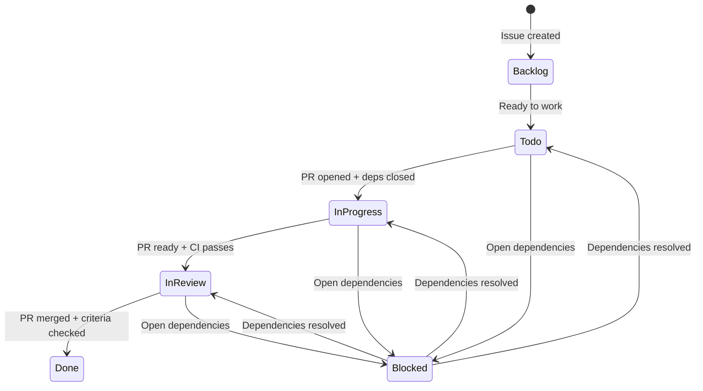

# GitHub Projects Daily Workflows

**Practical day-to-day development workflows for GitHub Projects V2**

**Prerequisites**: [GITHUB_PROJECTS_QUICKSTART.md](GITHUB_PROJECTS_QUICKSTART.md) for 5-minute introduction

---

## Table of Contents

1. [Issue Creation Workflows](#issue-creation-workflows)
2. [Issue Triage Workflows](#issue-triage-workflows)
3. [Implementation Workflows](#implementation-workflows)
4. [Automatic Status Transitions](#automatic-status-transitions)
5. [Project Board Management](#project-board-management)
6. [Milestone Management](#milestone-management)
7. [Release Workflows](#release-workflows)

---

## Issue Creation Workflows

### Method 1: Web UI with Templates (Recommended)

**When to use**: Creating individual issues with structured format

1. Navigate to: https://github.com/jvlivonius/vsc-extension-scanner/issues/new/choose
2. Select template (`feature.yml`, `task.yml`, or `release.yml`)
3. Fill in all fields:
   - Title: Clear, actionable description
   - Required Documentation: Comma-separated (e.g., "ARCHITECTURE.md, SECURITY.md")
   - Dependencies: "Blocked By: #N" if applicable
   - Acceptance Criteria: Specific, testable conditions
4. Submit → Issue auto-added to Project #3 in "Backlog"

**Result**: Structured issue with all metadata, ready for triage

### Method 2: CLI for Single Issues

**When to use**: Quick issue creation, automation scripts

```bash
gh issue create \
  --title "[FEATURE] Add CSV export" \
  --body "$(cat <<'EOF'
## Summary
Export scan results as CSV format for analysis in Excel/spreadsheet tools

## Required Documentation
ARCHITECTURE.md, SECURITY.md, PRD.md

## Dependencies
Blocked By: None
Blocks: None

## Acceptance Criteria
- [ ] CSV formatter handles special characters (commas, quotes)
- [ ] --output-csv CLI flag implemented
- [ ] Tests cover edge cases
- [ ] Documentation updated
EOF
)" \
  --label "feature,P1-high,complexity/M" \
  --milestone "v3.8.0"
```

**Note**: Add labels AFTER creation to trigger auto-sync workflow

### Method 3: Bulk Creation from Plan

**When to use**: Feature planning, creating multiple related issues

```bash
/gh:issues-create create-from-plan docs/archive/plans/v3.8-csv-export.md --milestone v3.8.0
```

**Plan format**:
```markdown
## Phase 1: CSV Formatter
### 1.1 Implement CSV formatter class
#### Required Documentation
ARCHITECTURE.md, SECURITY.md
#### Changes Required
...

### 1.2 Add export command to CLI
#### Required Documentation
ARCHITECTURE.md
#### Changes Required
...
```

**Result**:
- Parent feature issue created
- Child task issues created
- Parent-child relationships set automatically
- All linked to milestone and project board

**See**: [issues-create.md](../../.claude/commands/gh/issues-create.md) for full details

---

## Issue Triage Workflows

### Single Issue Triage

**When to use**: New issues needing classification

```bash
/gh:triage 160
```

**Process**:
1. AI analyzes issue content using sequential-thinking
2. Suggests:
   - Type (feature/bug/task/hotfix)
   - Priority (P0-P3)
   - Complexity (XS-XL)
   - Required documentation
3. Presents recommendations with confidence scores
4. Applies labels if confirmed

**Example output**:
```
Issue #160: Add CSV export functionality

Type: Feature ✓ (confidence: 95%)
Priority: P1-high ⚠️ (confidence: 85%)
Complexity: M (confidence: 80%)

Required Documentation:
- ARCHITECTURE.md, SECURITY.md, PRD.md

Apply suggestions? (y/n)
```

### Batch Triage

**When to use**: Weekly triage sessions, milestone planning

```bash
/gh:triage --batch --milestone v3.8.0 --limit 20
```

**Process**:
1. Fetches untriaged issues
2. Analyzes each with sequential-thinking
3. Groups by confidence:
   - High confidence (>90%): Auto-suggest
   - Low confidence (<70%): Manual review
4. Batch applies high-confidence suggestions

**Best practices**:
- Limit to 20-30 issues per batch (rate limiting)
- Review low-confidence issues manually
- Run weekly for consistent triage

**See**: [triage.md](../../.claude/commands/gh/triage.md) for full details

---

## Implementation Workflows

### Agent-Driven Implementation

**Prerequisites**:
1. Issue validated: `./scripts/github-projects/validate-agent-ready.sh <number>`
2. All dependencies closed
3. Required documentation specified

**Workflow**:
```bash
/gh:issues-implement 142
```

**Process**:
1. **Fetch**: Retrieve issue details, metadata
2. **Validate**: Check dependencies, docs, prerequisites
3. **Prepare**: Read required docs, create feature branch
4. **Implement**: Code changes following acceptance criteria
5. **Verify**: Run tests, security scans
6. **PR**: Create PR with issue linkage

**Branch naming**: Auto-generated from issue type and title
- Feature: `feature/add-csv-export`
- Bugfix: `bugfix/fix-memory-leak`
- Hotfix: `hotfix/security-cve-2024-12345`

**PR linkage**: Automatically adds "Closes #142" to PR description

**See**: [implement-issue.md](../../.claude/commands/gh/implement-issue.md) for full details

### Manual Implementation

**When agent implementation not suitable**:

1. **Create branch**:
   ```bash
   git checkout -b feature/my-feature
   ```

2. **Read required docs**:
   - Check issue "Required Documentation" field
   - Read each doc before starting

3. **Implement with quality gates**:
   ```bash
   # Make changes...
   python3 -m pytest tests/
   python3 tests/test_security.py
   python3 tests/test_architecture.py
   pre-commit run --all-files
   ```

4. **Create PR**:
   ```bash
   git push -u origin feature/my-feature
   gh pr create --title "feat(module): description" --body "Closes #142"
   ```

---

## Automatic Status Transitions

**Overview**: GitHub Actions workflows automatically transition issues through statuses based on PR events, dependency resolution, and completion criteria. This reduces manual status management and ensures consistent workflow enforcement.

### Status Flow Diagram



### Validation Requirements

| Transition | Required Conditions | Validation Checks |
|------------|---------------------|-------------------|
| **Backlog → Todo** | Manual | None |
| **Todo → In Progress** | ✅ PR opened<br>✅ All blocking dependencies closed | - Check issue body for "Blocked By: #N"<br>- Query GitHub API for dependency state<br>- Verify all blockers are CLOSED |
| **In Progress → In Review** | ✅ PR marked ready for review<br>✅ All CI checks pass | - Check PR draft status<br>- Query check runs for PR<br>- Verify all checks are SUCCESS |
| **In Review → Done** | ✅ PR merged<br>✅ All acceptance criteria checked<br>✅ All tests pass | - Check PR merged status<br>- Parse acceptance criteria section<br>- Verify no unchecked boxes `- [ ]` |
| **Any → Blocked** | ❌ Has open blocking dependencies | - Query GitHub dependency API<br>- Find dependencies via GraphQL<br>- Check if any blocker is OPEN |
| **Blocked → Previous** | ✅ All dependencies closed | - Check all blockers are CLOSED<br>- Restore previous status from comment<br>- Default to "Todo" if unknown |

### Workflow 1: PR-Based Status Transitions

**File**: `.github/workflows/auto-status-transitions.yml`

**Triggers**:
- `pull_request`: opened, ready_for_review, closed, reopened
- `pull_request_review`: submitted
- `check_suite`: completed

**Process**:
1. Extract linked issues from PR body/title (Closes #N, Fixes #N, Resolves #N)
2. For each linked issue, determine transition based on PR event
3. Validate transition requirements
4. Update status and add comment explaining reason

**Example scenarios**:

**Scenario A: PR Opened (Not Draft)**
```bash
# User creates PR with "Closes #142"
# Workflow checks:
✓ PR is not draft
✓ Issue #142 has no open blocking dependencies
# Result: Issue #142 → "In Progress"
# Comment: "🤖 PR #150 opened with all dependencies resolved"
```

**Scenario B: PR Ready for Review**
```bash
# User marks draft PR as ready
# Workflow checks:
✓ All CI checks pass
# Result: Issue #142 → "In Review"
# Comment: "🤖 PR #150 ready for review with passing CI"
```

**Scenario C: PR Merged**
```bash
# PR merges to main
# Workflow checks:
✓ All acceptance criteria checked in issue body
# Result: Issue #142 → "Done"
# Comment: "🤖 PR #150 merged with all acceptance criteria met"
```

**Scenario D: Blocked by Dependencies**
```bash
# PR opened but dependency #140 is still open
# Workflow checks:
✗ Dependency #140 is OPEN (must be CLOSED)
# Result: Issue #142 → "Blocked"
# Comment: "🤖 PR opened but dependencies not resolved"
```

### Status Transitions Limitations

**Current Implementation Status:**

#### ✅ Fully Functional

- **Comment-based tracking**: All status transitions add GitHub issue comments for visibility
- **Validation**: Dependencies, CI checks, and acceptance criteria validation working
- **Label sync**: Priority/Complexity labels automatically sync to project fields

#### ⚠️ Partial Implementation

- **Status field updates**: GraphQL mutation implemented but requires additional permissions
  - **Current**: Adds comment indicating new status
  - **Needed**: `read:project` and `write:project` token scopes
  - **Impact**: Status field must be manually updated or synced via labels
  - **Workaround**: Use comments for tracking, manual field updates via web UI

#### ❌ Not Automated

- **Acceptance Criteria updates**: Checkboxes are NOT automatically checked during implementation
  - **Current**: Manual updates required using `update-acceptance-criteria.sh` script
  - **Reason**: No automated code-to-criteria mapping system
  - **Impact**: Issues can get "stuck" with unchecked ACs, blocking status transitions
  - **Workaround**: Use script after completing each criterion (see `/gh:implement-issue` Pattern 5)

**To Enable Full Status Field Updates:**

1. **Generate new token** with additional scopes:
   ```bash
   # Go to: https://github.com/settings/tokens
   # Scopes needed:
   - repo (existing)
   - workflow (existing)
   - read:project (NEW - required)
   - write:project (NEW - required)
   ```

2. **Update repository secret**:
   ```bash
   # Settings → Secrets and variables → Actions
   # Update GITHUB_TOKEN or create new PROJECT_TOKEN
   ```

3. **Update workflow** (if using separate token):
   ```yaml
   env:
     GH_TOKEN: ${{ secrets.PROJECT_TOKEN }}  # Use token with project scopes
   ```

**See also**:

- [update-acceptance-criteria.sh](../../scripts/github-projects/update-acceptance-criteria.sh) - Helper script for AC updates
- [/gh:implement-issue Pattern 5](../../.claude/commands/gh/implement-issue.md#pattern-5-acceptance-criteria-tracking-important) - AC tracking workflow

### Workflow 2: Dependency-Based Blocking

**File**: `.github/workflows/auto-dependency-blocking.yml`

**Triggers**:
- `issues`: closed, reopened, edited

**Process**:
1. When issue is closed/reopened, find all issues blocked by it
2. For each blocked issue, check if ALL dependencies are closed
3. Update status to "Blocked" if any dependency is open
4. Restore previous status if all dependencies are now closed

**GraphQL Queries Used**:
```graphql
# Find issues blocked by this issue
query FindBlockedIssues($issueId: ID!) {
  node(id: $issueId) {
    ... on Issue {
      trackedInIssues(first: 100) {
        nodes {
          id
          number
          title
        }
      }
    }
  }
}

# Get all blocking dependencies for an issue
query GetBlockingDependencies($issueId: ID!) {
  node(id: $issueId) {
    ... on Issue {
      trackedIssues(first: 100) {
        nodes {
          number
          closed
        }
      }
    }
  }
}
```

**Example scenarios**:

**Scenario E: Dependency Resolved**
```bash
# Issue #140 (blocker) is closed
# Workflow finds issues blocked by #140: #141, #142
# For #141:
✓ All dependencies now closed
# Result: #141 transitions from "Blocked" → "In Progress" (previous status)
# Comment: "✅ All blocking dependencies resolved"
```

**Scenario F: Dependency Reopened**
```bash
# Issue #140 is reopened
# Workflow finds issues blocked by #140: #141, #142
# For #141:
✗ Dependency #140 is now OPEN
# Result: #141 → "Blocked"
# Comment: "🚫 This issue is blocked by: #140. Reason: Issue #140 was reopened"
```

**Scenario G: Cascading Dependencies**
```bash
# Chain: #140 blocks #141 blocks #142
# Issue #140 is closed
# First job: #141 unblocks (Blocked → In Progress)
# Second job (cascading check): Finds #142 is blocked by #141
# Result: #142 remains Blocked (dependency #141 still exists)
# When #141 closes: #142 unblocks automatically
```

### Workflow 3: Feature Auto-Completion

**File**: `.github/workflows/auto-feature-completion.yml`

**Triggers**:
- `issues`: closed

**Process**:
1. When sub-task closes, find parent feature issue
2. Check if ALL sibling sub-tasks are now closed
3. Validate parent acceptance criteria are checked
4. Close parent feature and add completion comment

**Example scenarios**:

**Scenario H: Last Sub-Task Completes**
```bash
# Feature #140 has 3 sub-tasks: #141, #142, #143
# Sub-tasks #141 and #142 already closed
# User closes #143 (last sub-task)
# Workflow checks:
✓ All sub-tasks (3/3) are closed
✓ Parent #140 is in "In Progress" status
✓ All acceptance criteria in #140 are checked
# Result: Feature #140 → "Done" (closed with "completed" reason)
# Comment: "✅ All sub-tasks completed! Auto-closing feature."
```

**Scenario I: Parent Criteria Not Checked**
```bash
# All sub-tasks complete but parent has unchecked criteria
# Workflow checks:
✓ All sub-tasks (3/3) are closed
✓ Parent #140 is in "In Progress"
✗ Parent has unchecked acceptance criteria
# Result: NO auto-close
# Comment: "⚠️ Auto-Completion Blocked: All sub-tasks completed, but unchecked acceptance criteria remain"
```

**Scenario J: Mixed Sub-Issue Types**
```bash
# Feature #140 has: 2 tasks (#141, #142) and 1 bug (#143)
# All close successfully
# Workflow: Treats all sub-issues equally
# Result: Feature #140 auto-completes when all close
```

### Status Tracking with HTML Comments

**Previous Status Storage**:
When marking an issue as "Blocked", the workflow stores the previous status in a hidden HTML comment:

```html
<!-- AUTO-BLOCKED: previous_status=In Progress -->
🚫 Automatic Blocking Detection: This issue is blocked by #140.
```

**Status Restoration**:
When unblocking, the workflow parses comments to find the most recent previous status and restores it. Defaults to "Todo" if no previous status is found.

### Manual Override: skip-automation Label

**Purpose**: Bypass automatic status transitions for manual control

**Usage**:
```bash
# Add label to disable automation for this issue
gh issue edit 142 --add-label "skip-automation"

# Manually manage status as needed
# (Use project board or manual status commands)

# Remove label to re-enable automation
gh issue edit 142 --remove-label "skip-automation"
```

**Effect**: All three automation workflows check for this label and skip processing if present.

### Troubleshooting Automatic Transitions

**Q: Why didn't my issue transition to "In Progress" when I opened a PR?**

**Common causes**:
1. **PR doesn't reference issue**: Add "Closes #N", "Fixes #N", or "Resolves #N" to PR title or body
2. **Blocking dependencies open**: Check if issue has "Blocked By: #X" and dependency #X is still open
3. **PR is draft**: Mark PR as ready for review to trigger transition
4. **Workflow delay**: Wait 1-2 minutes for GitHub Actions to process

**Verification**:
```bash
# Check if PR correctly links to issue
gh pr view 150 --json body | jq -r '.body' | grep -i "closes\|fixes\|resolves"

# Check dependency status
./scripts/github-projects/validate-agent-ready.sh 142

# Check workflow runs
gh run list --workflow=auto-status-transitions.yml --limit 5
```

**Q: Why didn't my issue transition to "In Review" when PR is ready?**

**Common causes**:
1. **CI checks failing**: All checks must pass (status: SUCCESS)
2. **PR still draft**: Must be marked as ready for review
3. **Workflow timing**: Wait for check_suite to complete

**Verification**:
```bash
# Check CI status
gh pr checks 150

# Manually trigger if needed
gh workflow run auto-status-transitions.yml
```

**Q: Why didn't my feature auto-complete when all sub-tasks closed?**

**Common causes**:
1. **Parent has unchecked criteria**: All `- [ ]` must be `- [x]` in acceptance criteria
2. **Parent wrong status**: Must be "In Progress" or "In Review"
3. **Parent not a feature**: Must have "feature" label
4. **Sub-tasks not linked**: Must use GitHub's native sub-issue relationships

**Verification**:
```bash
# Check parent acceptance criteria
gh issue view 140 --json body | jq -r '.body' | grep -A 10 "Acceptance Criteria"

# Check sub-task linkage
./scripts/github-projects/manage-issue-relationships.sh view 140

# Check parent status
gh issue view 140 --json projectItems | jq -r '.projectItems[0].status.name'
```

**Q: How do I manually override automation?**

**Solution 1: skip-automation label**
```bash
gh issue edit 142 --add-label "skip-automation"
# Manually manage status, then remove label
gh issue edit 142 --remove-label "skip-automation"
```

**Solution 2: Manual status update**
```bash
# Update via project board UI: Click Status cell → Select value
# Or force close/reopen:
gh issue close 142 --reason "not planned"
gh issue reopen 142
```

**Q: Rate limit errors in workflows**

**Solution**:
- Workflows include exponential backoff for rate limiting
- GitHub Actions has higher rate limits than personal tokens
- Check: `gh api rate_limit --jq '.resources.core'`
- If persistent, stagger issue/PR operations

**Q: Workflows not triggering**

**Verification**:
```bash
# Check if workflows are enabled
gh workflow list

# View recent runs
gh run list --limit 10

# Check specific workflow
gh workflow view auto-status-transitions.yml

# Manually trigger if needed
gh workflow run auto-status-transitions.yml
```

### Best Practices for Automation

**Issue Creation**:
- ✅ Always use "Blocked By: #N" format in issue body (not just text description)
- ✅ Set up GitHub native dependencies via `manage-issue-relationships.sh`
- ✅ Write clear acceptance criteria with checkboxes `- [ ]`

**PR Creation**:
- ✅ Use "Closes #N" in PR description (not just comments)
- ✅ Mark draft PRs when not ready for review
- ✅ Ensure CI checks are configured and passing

**Feature Management**:
- ✅ Use GitHub native sub-issue relationships (not just text mentions)
- ✅ Check all acceptance criteria before closing last sub-task
- ✅ Keep parent in "In Progress" or "In Review" for auto-completion

**Debugging**:
- ✅ Wait 1-2 minutes for workflows to process
- ✅ Check workflow run logs for validation failures
- ✅ Use `validate-agent-ready.sh` to pre-check requirements
- ✅ Add `skip-automation` label for manual control

### Workflow Files Reference

| Workflow | File | Purpose |
|----------|------|---------|
| Status Transitions | `.github/workflows/auto-status-transitions.yml` | PR-based status transitions with validation |
| Dependency Blocking | `.github/workflows/auto-dependency-blocking.yml` | Auto-block/unblock based on dependencies |
| Feature Completion | `.github/workflows/auto-feature-completion.yml` | Auto-close features when all sub-tasks done |
| Test Workflows | `.github/workflows/test-automation-workflows.yml` | Manual test scenarios for validation |

**See also**:
- [GITHUB_RELATIONSHIPS.md](GITHUB_RELATIONSHIPS.md) - Dependency and parent-child setup
- [validate-agent-ready.sh](../../scripts/github-projects/validate-agent-ready.sh) - Pre-implementation validation

---

## Project Board Management

### Moving Issues Through Workflow

**Kanban Board**: https://github.com/users/jvlivonius/projects/3/views/1

**Status transitions**:
1. **Backlog → Todo**: Drag when ready to work
2. **Todo → In Progress**: Drag when you start
3. **In Progress → In Review**: Auto-transitions when PR opens
4. **In Review → Done**: Auto-transitions when PR merges

**Manual status update** (if needed):
```bash
# Via project board: Click Status cell → Select value
# Via CLI: Update labels if using custom status labels
gh issue edit 142 --add-label "status:in-progress"
```

### Common Filters for Daily Work

**Your Active Work**:
```
assignee:@me status:"In Progress"
```

**Ready to Start**:
```
status:Backlog,Todo priority:Critical,High -assignee:@me
```

**Needs Review**:
```
status:"In Review" assignee:@me
```

**Blocked Items**:
```
status:Blocked -status:Done
```

**Current Milestone**:
```
milestone:"v3.8.0" -status:Done
```

**See**: [GITHUB_FILTERS.md](../guides/GITHUB_FILTERS.md) for advanced filtering patterns

### Setting Relationships

**Parent-Child** (feature breakdown):
```bash
# Feature #142 has tasks #143, #144, #145
./scripts/github-projects/manage-issue-relationships.sh set-parent 142 143 144 145

# Verify
./scripts/github-projects/manage-issue-relationships.sh view 142
```

**Blocking** (dependencies):
```bash
# Issue #146 blocks issue #147
./scripts/github-projects/manage-issue-relationships.sh set-blocker 147 146

# Verify
./scripts/github-projects/manage-issue-relationships.sh view 147
```

**See**: [GITHUB_RELATIONSHIPS.md](GITHUB_RELATIONSHIPS.md) for comprehensive guide

---

## Milestone Management

### Creating Milestones

**For new releases**:
```bash
/gh:milestone create v3.8.0 --due 2025-01-15 --description "CSV export and performance improvements"
```

**Result**: Milestone created, ready to link issues

### Tracking Progress

**Weekly progress report**:
```bash
/gh:milestone report v3.8.0 --format markdown
```

**Output**:
```markdown
# Milestone Report: v3.8.0

## Progress Summary
- Completion: 67% (8/12 issues)
- Open: 4 issues
- Closed: 8 issues

## Open Issues
- #142: Add CSV export (P1-high)
- #143: Implement formatter (P1-high)

## Blocked Issues
- #145: Blocked by #142
```

### Syncing to Project Board

**After bulk label changes or weekly sync**:
```bash
/gh:projects-sync milestone v3.8.0
```

**Process**:
- Fetches all milestone issues
- Updates project board status
- Moves closed issues to "Done"
- Syncs Priority/Complexity fields from labels

**See**: [milestone.md](../../.claude/commands/gh/milestone.md) for full details

---

## Release Workflows

### Pre-Release Phase

**1. Create milestone**:
```bash
/gh:milestone create v3.8.0 --due 2025-01-15
```

**2. Create issues from plan**:
```bash
/gh:issues-create create-from-plan docs/plans/v3.8.md --milestone v3.8.0
```

**3. Weekly tracking**:
```bash
/gh:milestone report v3.8.0
```

### Development Phase

**4. Implement issues**:
```bash
# For each ready issue:
./scripts/github-projects/validate-agent-ready.sh 142
/gh:issues-implement 142
```

**5. Sync board weekly**:
```bash
/gh:projects-sync milestone v3.8.0
```

### Release Phase

**6. Generate release notes**:
```bash
/gh:projects-sync release-notes v3.8.0 --draft
```

**7. Close milestone**:
```bash
/gh:milestone close v3.8.0 --generate-notes
```

**8. Tag and publish**:
```bash
git tag -a v3.8.0 -m "Release v3.8.0"
git push origin v3.8.0
python3 -m build && twine upload dist/*
```

**See**: [RELEASE_PROCESS.md](RELEASE_PROCESS.md) for complete release workflow

---

## Automation Patterns

### Label Sync Automation

**Automatic**: GitHub Actions workflow syncs labels to project fields

**Trigger**: `labeled` or `unlabeled` event on issues

**Delay**: 1-5 minutes for sync to complete

**Verification**:
```bash
# Check workflow runs
gh run list --workflow=sync-project-fields.yml --limit 5

# Manual sync if needed
./scripts/github-projects/sync-existing-issues.sh
```

**See**: [_gh-reference.md](../../.claude/commands/gh/_gh-reference.md#label-sync-timing) for details

### Issue Auto-Linking

**Automatic**: PRs with "Closes #N" auto-link to issues

**Trigger**: PR description contains GitHub keywords

**Keywords**: `Closes`, `Fixes`, `Resolves` followed by `#N`

**Result**: Issue auto-closes when PR merges, status moves to "Done"

### Dependency Tracking

**Automatic**: Agent checks blocked-by dependencies before implementation

**Workflow**:
1. Issue body contains "Blocked By: #140"
2. `/gh:issues-implement` validates #140 is CLOSED
3. Errors if blocker still OPEN

**Manual check**:
```bash
./scripts/github-projects/validate-agent-ready.sh <issue-number>
```

---

## Common Scenarios

### Scenario 1: Feature Development

```bash
# 1. Plan: Create feature with tasks
/gh:issues-create create-from-plan docs/plans/csv-export.md --milestone v3.8.0

# 2. Triage: Set priorities
/gh:triage 142  # Parent feature
/gh:triage 143  # Task 1
/gh:triage 144  # Task 2

# 3. Implement: Start with first task
/gh:issues-implement 143

# 4. Track: Monitor progress
/gh:milestone report v3.8.0

# 5. Release: Close when complete
/gh:milestone close v3.8.0 --generate-notes
```

### Scenario 2: Bug Fix

```bash
# 1. Create: Report bug
gh issue create --title "[BUG] Memory leak in scanner" --label "bug,P0-critical"

# 2. Triage: Analyze priority
/gh:triage 150

# 3. Implement: Fix immediately
/gh:issues-implement 150

# 4. Verify: Ensure fix works
# (Tests run automatically during implementation)
```

### Scenario 3: Weekly Planning

```bash
# 1. Review: Check milestone progress
/gh:milestone report v3.8.0

# 2. Triage: Process new issues
/gh:triage --batch --milestone v3.8.0 --limit 20

# 3. Prioritize: Update priorities
# (Use project board filters and drag-drop)

# 4. Sync: Update board
/gh:projects-sync milestone v3.8.0
```

---

## Troubleshooting

**Issue not showing on project board**:
- Wait 1-2 minutes for auto-sync
- Manual add: Project board → "+" button → Select issue

**Labels not syncing to fields**:
- Wait 1-5 minutes for GitHub Actions
- Check: `gh run list --workflow=sync-project-fields.yml`
- Manual sync: `./scripts/github-projects/sync-existing-issues.sh`

**Parent-child not working**:
- Use script: `./scripts/github-projects/manage-issue-relationships.sh`
- Must use GraphQL API (REST API doesn't support)

**Rate limit errors**:
- Check: `gh api rate_limit`
- Wait for reset or switch token: `gh auth switch`

**Implementation blocked**:
- Run: `./scripts/github-projects/validate-agent-ready.sh <number>`
- Fix validation errors before `/gh:issues-implement`

---

## Best Practices

**Issue Creation**:
- Use templates for consistency
- Always specify "Required Documentation"
- Add clear acceptance criteria
- Set milestone immediately

**Triage**:
- Triage within 24 hours of creation
- Use AI suggestions but verify
- Batch triage weekly for efficiency

**Implementation**:
- Validate dependencies first
- Read required docs before coding
- Run all quality gates before PR
- Link PRs to issues with "Closes #N"

**Project Board**:
- Drag cards daily as status changes
- Use filters for focused views
- Keep "In Progress" limit to 3-5 items
- Archive "Done" items monthly

**Milestones**:
- Weekly progress reports
- Sync board after batch changes
- Close only when all critical issues resolved

---

## References

- [GITHUB_PROJECTS_QUICKSTART.md](GITHUB_PROJECTS_QUICKSTART.md) - 5-minute introduction
- [GITHUB_RELATIONSHIPS.md](GITHUB_RELATIONSHIPS.md) - Parent-child and blocking
- [GITHUB_FILTERS.md](../guides/GITHUB_FILTERS.md) - Advanced filtering
- [_gh-reference.md](../../.claude/commands/gh/_gh-reference.md) - Command reference
- [issues-create.md](../../.claude/commands/gh/issues-create.md) - Issue creation
- [triage.md](../../.claude/commands/gh/triage.md) - Issue triage
- [implement-issue.md](../../.claude/commands/gh/implement-issue.md) - Implementation
- [milestone.md](../../.claude/commands/gh/milestone.md) - Milestone management
- [projects-sync.md](../../.claude/commands/gh/projects-sync.md) - Project sync

---

**Last Updated**: 2025-11-21
**Status**: Active
**Maintainer**: Update workflows as team practices evolve
